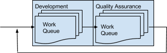

--------------
Creating a Testing Culture
--------------

## 1.1 - The Scientific Method

[https://www.youtube.com/watch?v=b240PGCMwV0]

[http://www.mheducation.ca/school/products/9780070726024/mhr+discovering+science+7/]

ScienceSkill 1 Organizing and Communicating Scientific Data

[http://en.wikipedia.org/wiki/Scientific_method#Elements_of_the_scientific_method]

* Observe
* Hypothesize
  * use cases
  * user expectations
  * nullable
* Test
  * defined process that will demonstrate the expectation
  * reproducible
  * the statement has been made, others should be able to reproduce your results: otherwise you are Just Making Shit Up®
* Conclusion
  * pass/fail
  * did the process fail the test?
  * did the test fail the process?
  * Is the expectation realistic?
* Peer Review
  * error reports
  * once software is released it has many eyes on it

When in

### Laboratory to Production

Moving a developed process from the laboratory to the manufacturing 
plant requires that the high order thinking of the researcher, be 
broken down to simple steps that can be delegated with minimal 
training to employees.

## Assumptions

To a certain extent, when investigating processes, we have to assume 
a certain “happy” example. Rather than dealing with every single 
problem that exists in the world, we work to solve just one set of 
problems. 

Throughout this document certain assumptions are made regarding the 
processes and nature of the teams involved. While these assumptions 
are not necessarily true in any given environment, these assumptions 
are used to define the scope of this document. 

### Software Systems

While much of what is discussed is relevant to Quality Control in general, this discussion is based on experiences in Software and Digital systems, and therefore focuses on solutions for those fields. 

### Members are Motivated

For the most part this is not an issue, people take pride in their work, and are interested in making their company, their product, or their service better.

Unfortunately, this is not 100% true. Some people just don't care. If the people involved don't care about the system they are building, there is nothing that can be done to improve the system. 

Solving the disinterested employee problem is out of the scope of this discussion. For the purposes of this discussion, I am assuming that the people involved care.

## What is a "Test"

Tests are a measure of the system's conformation with user expectations.

This means that testing is a form of specification writing. The generation of a test is not an act unto itself, it is a part of the defining the scope of the system. 

Notice that I say "the generation of a test": Tests are not an action that is performed, they are a definition of a set of steps.

Testing is a guide for action, not the action itself. 

### Tests are Consistent

In order for the Test to be meaningful it has to be consistently reproducible. In many ways the Test is like a laboratory definition of the set of steps that make up a scientific experiment. When we don't achieve the anticipated result, we have learned something interesting. What is important is that the steps produce consistent results. If the results are inconsistent (different things happen at random) it is not possible to derive any meaning from them. It is the reproducibility of the test that makes it meaningful: when I take certain steps, certain events occur.

In order for a test to be reproducible, the exact steps to reproduce the results need to be documented, in excruciating detail. By writing the steps down, you are confident that no steps will be missed. If a step is missed, then the test is invalid because you have not undertaken all the actions necessary to reproduce the results. 

Once upon a time, a colleague was complimenting (ok, actually he was teasing) me on my detailed configuration instructions for a complex configuration that I had messed up. There had been some tension in the office because I had rewritten someone else's instructions to make them simpler. My joked that I had made it so bonehead simple nobody could screw it up no matter how stupid they were; it occured to me at that moment: "You have to make instructions simple, otherwise stupid people won't understand them, and smart people will find a way to misinterpret them."

### Tests are Training Material

This is of huge benefit to the the New Guy. Coming in cold to any system is difficult, under these conditions, The New Guy has access to a significant amount of documentation, regardless of what his role is: 

Users: acting as a tester will give a very detailed look at all of the usages they are expected to encounter. In this case, it becomes a sort of user manual. 

Documentation Author: the tests represent detailed instructions for how to use the system. The new document writer can use the test list as a quick boost to writing the instructions in a distributable manner. 

Developer: developers want to look for samples of code when learning a new system. Done correctly, tests act as an in-house library of code samples. 

Closely related to New Guy, is Future Self. Tests are a way of communicating with ourselves when designing new features, or redesigning existing ones. By writing the expectations out in a detailed fashion, all parties have a written contract as to what their expectations are. Future Self also has a way to follow up with the rationale that prompted doing something the way it was done in the first place. While the expectations may change, we have clearly defined what they are at this point. 

In the end a Test is simply a form of garnering Feedback. The results of tells the developers that Testing is about garnering feedback. The purpose of feedback is so we can understand where we need to take action.

Therefore testing is a guide for action, not the action itself.

#### Test Driven Development and Intensive Fast Failure

Dr. Jack Matson - Intensive Fast Failure - wrote “Innovate or Die”

## Risks of Testing

One of the consistencies in life that I have discovered is that if something is of value, there are risks associated with it.

There are risks associated with testing. 

Generally, the objective of Testing is to decrease the probability of bugs being released into our code that is delivered to the customer. More generally, we are trying to make things better. 

Unfortunately, as with any process or tool, there are certain risks associated with Testing. These risks can actually increase the probability of problems appearing in the system. Generally, this is due to a misuse and mishandling of what the testing processes are attempting to achieve and what they are capable of. 

Once understood, it is possible to mitigate the risks associated with Testing. 

### False Security

In 1981, studies discovered something interesting: removing a doctor's mask during surgery actually reduced incidents of post-surgical infection. Several causes for these results have been postulated: that the addition of the protective equipment had lead to the doctors taking larger risks, or that improper use of the protective equipment (due to complacency) had led to an increase in problems. Over the years similar situations have been identified, where the addition of safety equipment has led to an increase in incidents. To pull a couple examples from Wikipedia: 

* Skydiving
* Anti-lock Braking Systems

This effect, known as Risk Compensation, is controversial, however there are some standard elements that can be derived: 

Increasing the use of safety equipment, increases the risk tolerance. Effectively, with safety equipment you can get closer to "the edge". This is the positive effect we are looking for.

The perceived capabilities of the equipment can exceed the actual capabilities. In other words, people may come to rely on the safety equipment and become complacent in their behaviour. This is the negative effect we need to watch for.

The balance between the two original examples is what we are striving for. In the case of Seatbelt usage, people tend to behave a little more dangerously, but receive a lot more protection. 

In software development, this translates to higher productivity (greater risk taking), with reduced bug reporting (greater protection). The problem becomes how to control the negative side: by putting the safety mechanism in place some people tend to rely on the tool rather than their own good sense. To paraphrase a firearms instructor (Sanjay Malhotra), The safety on a firearm is installed between your ears. 

Testing is a quality control tool which acts as a safety mechanism to prevent Users from receiving a poor customer experience. By placing testers between the development team and the end user, developers can experience a sense of dissociation from the users. While this dissociation often increases productivity, it can also decrease the sense of responsibility. Instead of conducting thorough investigations of the components they produce, they begin to feel that the safety net (the testers) will catch the ones that get through, and therefore not worry about them as much. Rather than conducting their own investigation, they will rely on the investigation of the tester to catch their problems for them. 

This causes two problems:

The developer is the person that is most familiar with the system and is, therefore, the most likely to be aware of the weaknesses and harmful edge cases; but is not looking at for them.
What was put in place as a redundant secondary system, has become the primary system with no redundancy.

To mitigate this issue, it is important to maintain a sense of responsibility and clear lines of accountability to individuals that are responsible for the quality of the system or its individual components. 

### Gaming the System

Goodhart's Law states that When a measure becomes a target, it ceases to be a good measure. One of the most evident applications of Goodhart's law is in the measurement of Gross Domestic Product (GDP). GDP is a measure of the productive wealth of a nation, but performs that measure by looking at the side effects of production. When governments set the objective increase the nation's GDP it will begin to manipulate the side effects (directly within its influence), not the national wealth (not within its influence). The side effects increase, but the wealth will remain the same. 

The same effect can be observed in the grocery store. Chickens are sold by weight. Customers demand more food stuff per dollar. Unfortunately, the measure of "foodstuff" is the weight of the food. The objective is therefore transformed from “more foodstuff” to “more weight”. Now that the measure has become the objective, lower cost fillers can be used to increase the mass of the food. In the case of chicken, this is often achieved by injecting water into the meat. Since water is not a foodstuff, the measure of weight has become meaningless. 

This same problem often becomes evident in testing. As testing is simply a measure of the health of a system, people will tend to focus on meeting "measurable goals". Pass/Fail measures of quality create the ability to use Volume of Pass as a quantitative measure. As people begin to observe the counts of successes, they will tend to view this as both a measure of their own success, and as an objective to be met. 

There are fundamental flaws with treating qualitative data in a quantitative manner. Firstly, in an effort to meet objectives, test developers may make their tests easier to pass. In his article The Joel Test, Joel Spolsky identifies an extreme case of a Microsoft employee writing poor code simply to achieve a goal of “done” (quantity), while not meeting the spirit of “done” (quality). 

The story goes that one programmer, who had to write the code to calculate the height of a line of text, simply wrote "return 12;" and waited for the bug report to come in about how his function is not always correct. The schedule was merely a checklist.... In the post-mortem, this was referred to as "infinite defects methodology".

Attention must be paid to not allowing the "score" to matter, or even better, not allow their to be a concept of "score" in the first place. 

Team members must always be actively encouraged to create harder tests; pushing the system (and themselves) to become progressively better over time. Rather than a scoring system, testing should be viewed like athletes view their measures. When a weight lifter reaches his goal of 200 kilograms, he redefines the goal by adding 20 kilograms; when a runner can run 10km, she increases the objective to 15km; when a developer gets a long loading report down to 5 seconds, he changes the objective to 3 seconds. 

Managers can help foster this environment by never explicitly using the tests as a measure of performance. Rather they should incentivise efforts to increase the thoroughness of testing. 

### Personal Failure

Recently, I was asked by a developer to come over to his desk to “look at something”. I dropped what I was doing, walked over to his desk, and stood by while he asked “is this working?”. 

I was annoyed.

I had reviewed the work once already, and found a minor flaw in the solution. The success/failure criteria were clearly laid out in the ticketing system: either the problem had been fixed, or it hadn't. There was no need to pull me away from other testing, that had been in my queue for days, to run a test of the system on his computer, all he had to do was compare the results on his screen to what I had already said in writing. Worse, once he submitted the change, I would still be required to perform official, documented, and detailed, testing; all resulting in a longer amount of time being required to achieve the same results. 

The worst part, this wasn't the first time this developer had done this, or the first time other developers had done it. When asked, developers have always had the same answer: I didn't want it to fail again. I find that statement odd since whether I'm sitting at my desk or theirs the test has still failed. However, from the developers perspective, so long as the failure isn't documented, it is perceived as less of a failure. 

I don't understand the phenomenon, but whenever you tell a person that there is a problem with their work, they assume you mean you have a problem with them; that they are a failure. This is closely intertwined with Gaming the System, and is probably the root cause. We are taught from a very early age that the scores and grades we receive on tests are what is important about us, not the knowledge we have gained, not the process, just the final score. Therefore, we engage in trying to change our score. This leads to a problem wherein people view a poor score as a reflection of themselves. Scores and measures are synonyms, therefore if you identify a failure, they take it as a personal attack on them. This must not be allowed to happen. 

Success and Failure of tests is about creating dialogue.

A successful run of a test does not mean that the system is behaving well, instead it means that the person who defined the test, and the person that built the system agree as to what the behaviour should be. 

It is possible that both are wrong.

Given that both could be wrong, in a success case; it stands that either could be wrong in a disagreement case. There are three states: 

|      | Pass           | Fail           |
|------|----------------|----------------|
| Pass | (/) Agree-Pass | (x) Disagree   |
| Fail | (x) Disagree   | (?) Agree-Fail |

<dl>
 <dt>Agree-Pass</dt>
  <dd>
Both measurers (the test and the development) agree that the 
expectations have been met
  </dd>
 <dt>Disagree</dt>
  <dd>
We don't know who is correct, but there needs to be further 
discussion to determine what the customer's expectations are. This 
may be cleared up by a quick discussion (oops, missed something), or 
could result in the entire project having to be redesigned due to a 
flawed assumption. In either case, the underlying truth has been 
discovered.

The key is we have found a problem and are dealing with it.
  </dd>
 <dt>Agree-Fail</ddt>
  <dd>
This should never occur. If the developer feels it has not passed 
their standards, it should not have left their desk. However, it does 
occur, generally due to pressure on the developer to complete their 
task. 
  </dd>
</dl>

Developers must be aware of this ingrained response we have as 
humans, and fight it. Failing a test only means that there is a 
difference of expectations, a misunderstanding. Testing exists to 
find those misunderstandings.

## Responsibility for Testing

Generally, testing is viewed as a the Quality Assurance person's job, but that doesn't quite capture the essence of the relationship. While QA's primary tool is the test, the tests are the means to the end, rather than an end themselves. 

If we look at any development process, developers always run their own code. They always check to see that it is working. Having a second set of eyes on it is important, but simply as part of being asked to solve a problem, they check to see that the problem is solved. This has been formalized, but it is important to recognize that the very definition of undertaking a task dictates a mechanism to determine that you have completed the task: a measure, or a Test. 

This fundamental interpretation of taking action, indicates that “Testing” is part of developer's responsibility. If we have assumed that Testing is the Quality Assurance Department's responsibility and we have found that it is also the Development Department's responsibility, we need to ask who else is responsible that we haven't considered. 

The answer is simple: everyone is a Tester, everyone is responsible for Testing. 

Everyone has their area of expertise, and their area of expertise will create bias. This combination of bias and expertise means that some individuals are better at finding certain problems than others. We need to harness this range of expertise to maximize quality, while at the same time compensating for one another's biases. This “Peer Review” process is what keeps us from falling into biased patterns. 

Every stage of the development process is responsible to ensure the system is working as expected, and it is everyone's responsibility to check one another's work. Well documented tests allow us to verify and validate one another's results, watching for mistakes that hide in our blind spots.

## Key Phrases in Testing

???

## Cross-cutting Concerns

Testing is *everybody's* business. Every aspect of production has an 
interest in seeing that their role is performing as expected. People 
will conduct tests to ensure that their part of the system is 
performing as expected. 

This is why formalized testing is not just the role of a QA 
professional, nor should a QA professional be confined to the walls 
of a "Testing" department. 

### Organizational Structure Level 0: Putting the Cart Before the Horse

This is the obvious, and usually first choice for management to 
divide the organizational structure into. 

Generally organizations will have the development department submit 
their finished product to the testing department who will then queue 
the work for testing. This unfortunately divides the two roles, and 
creates a gap between them, reducing overall communication and 
increasing the time lag between communication events when they 
occur. 

The steps taken become very disjointed:

1. The developer assesses the expectations
2. The developer implements those expectations
3. The developer considers it “done” and puts it in Quality 
   Assurance's inbox for testing
4. Quality Assurance assesses the expectations
5. Quality Assurance implements validation checks, some of which fail
6. QA places the work back in Development's inbox, with the validation 
   checks attached.
7. Goto Step 1

### Organizational Structure Level I: Having a Plan

One obvious solution to the redundant effort noted is to place the 
test definition prior to the production. By defining the validity 
checks prior to the development process, developers do not risk 
developing against faulty expectations. The expectations of success 
are clearly defined prior to them writing the first line of code. 

The drawback to this model is that as development occurs, new ideas 
get discovered, new ways of looking at things become apparent. 
Effectively, this is the waterfall method of development where 
developers are told what they will produce, and have no mechanism 
for offering feedback, except to put the item right back into the 
tester's queue.

### Organizational Structure Level III: Unity

Rather a more vertical and integrated approach should be taken. In 
the end, we are all on the same team. 

With this configuration, the workflow is much tighter and the feedback generated by both QA and the Developers allows them to react to one another's suggestions immediately, reducing the need for massive adjustments later on. 

Not only can the feedback cycle be reduced, experts are better able to learn from one another. When automating a test, who could be a better resource to ask for advice than a developer who sits across from you? 

In fact, this is not limited to just the developers and the Testers. As the tests are implemented, feedback from the results may challenge the Business Analyst's expectation of the anticipated workflow. Why not bring them into the mix? How about Technical Writers? Surely code documentation could benefit from a professional editor and clearly written test summaries can influence the approach taken by a junior tester. 

Every member of the team is responsible for every aspect of quality. 

## Quality Assurance across departments</h2>

At the very least, it is important for every member to have a basic understanding of the teams work in order to understand how to integrate and work together. 

<table>
 <tbody>
  <tr>
   <td></td>
   <th>Tester</th>
   <th>Dev</th>
   <th>Analyst</th>
   <th>Writer</th>
   <th>more...</th>
  </tr>
  <tr> 
   <th>Testing</th>
   <td></td>
   <td>Writes Automated tests</td>
   <td></td>
   <td></td>
   <td></td>
  </tr>
  <tr> 
   <th>Dev</th> 
   <td></td>
   <td></td>
   <td>Debug Code/Interpret code capabilities</td>
   <td></td>
   <td></td>
  </tr>
  <tr>
   <th>Analysis</th>
   <td>Determine Dangerous System Usages</td>
   <td>Implementation Decisions</td>
   <td></td>
   <td>Explain Need to Users</td>
   <td></td>
  </tr>
  <tr>
   <th>Writing</th>
   <td>Defines Tests</td>
   <td>Creates Documentation</td>
   <td>Writes Need Assessments</td>
   <td></td>
   <td></td>
  </tr>
  <tr>
   <th>more...</th>
   <td></td>
   <td></td>
   <td></td>
   <td></td>
   <td></td>
  </tr>
 </tbody
</table>

No matter which department is handling an issue, validation, and evidence driven analysis improves quality. You can't make improvements unless you have evidence that something is behaving in an unexpected manner. You can't demand improvement unless you measure the deficiency.

Quite often a System Analyst is expected to take a broad view of their system, and assure that it is behaving well from the customers point of view. However, this means testing the system across several areas of expertise that are generally assigned to specialized areas. Taking a system perspective, we can ask questions that span multiple areas of expertise to identify potential issues:

### System Quality

Infrastructure

When investigating "System Quality", we are generally asking questions about the performance of the underlying system. A thousand little moving parts are associated with large systems, and each of them must perform to deliver the expected service. Many times a single failure of any part of underlying infrastructure that we take for granted can result in unexpected and catastrophic failures.

Many years ago, a friend of mine was working an IT Help-desk. He was sitting in the break room when someone ran in and demanded "all hands on deck". The phones were suddenly backing up.

Nobody was sure what had exactly happened, but all customers in the Texas area had lost their internet connectivity. It didn't matter whether they were business or personal, they were all phoning in at once. Details were a little sketchy, something to do with a squirrel, a power line, and a data junction. Known facts: fixed, dead squirrel, unhappy customers.

What can we take away from this little story? Systems fail, unpredictably and unexpectedly. If you have begun wondering why a squirrel had access to the delicate area, you are missing the point. Remember the objective is not to ascribe blame, but to solve problems. Generally, it is not possible to predict how something is going to fail (if we could predict it, we would handle the scenario).

Questions as simple as "Is the system available?" are highly critical to be monitoring.

#### Frequency

Tests like this should be run real-time. Depending on the system real-time could mean as infrequently as daily though could also mean as frequently as every millisecond. Naturally, the cost/benefit comparison needs to be considered of having real-time checking versus overloading the system with checks.

#### Sample Questions

As with most tests, it is best to ask the most generic question first and work down to most specific ones. To use the example of the squirrel and the power-line, asking "Has an armadillo chewed through the lines" is too specific, asking "has an animal chewed the power-lines" is better, asking "do we have power?" catches all the scenarios. The most general question we can ask is "Is the system available?"

In a web based environment this is as simple as opening one of the web pages and will answer 99% of your "is it up" questions. Once we have answered this question there are many others that can help identify problems before they occur.

* Is the system available?
* Is the system responding in an acceptable time limit?

There are much more detailed questions that could be asked, and often are by an infrastructure group

* What percentage of RAM is the server consuming?
* How much Hard drive space is remaining?
* How much bandwidth is being consumed?

Naturally, asking these questions is one thing. More importantly, someone has to be listening to the answers. No matter what question is asked it is important that individuals are notified when there is an unpleasant answer. This goes to transparency. Recently, I was involved in a situation where a colleague received an email from their manager, who had received an email from the infrastructure manager, who had received an email from an Infrastructure Analyst, who had received an email from a System Monitor: a hard-drive was nearly out of space. The total time from initial alert to finally getting the message to the person that could do something about it was 6 hours.

If this system had a monitor that simply checked the speed at which forms loaded, my colleague would have been notified that *something* was wrong much earlier. While she may not have been aware of what the problem was, she would have initiated an investigation significantly earlier.

The more eyes that are on a problem, the faster it gets solved. This is the principle of transparency

Brainstorming ideas of monitors

* things like alarms, monitors
  * Ping the server every 5 minutes
  * Web app? Check the front page. Did it load?
  * Critical service? Is it loaded in memory and running? Did the 
    time-stamp on the log change in a reasonable amount of time ago?
* system scans for known issues are always useful. Sometimes you end 
  up with a known bad data state. You understand what data causes the 
  problem, you even know how to fix it when it occurs. For the life 
  of you, you can't figure out how it gets that way. While you are 
  investigating the root cause, why not run periodic system scans for 
  the bad state. It would at least allow you to respond to problems 
  much quicker.

### Functional Behaviour

* does it do what we expect it to do?
* regression testing is important - when I change one thing, there is a risk of “bumping” other parts of the system

### Business Expectations

* are the specs meaningful?
* we can test the specs by rewriting them

## Standards Conformance

* are all of the website's links valid?
* are content authors using using effective keywords
* spell-checking

